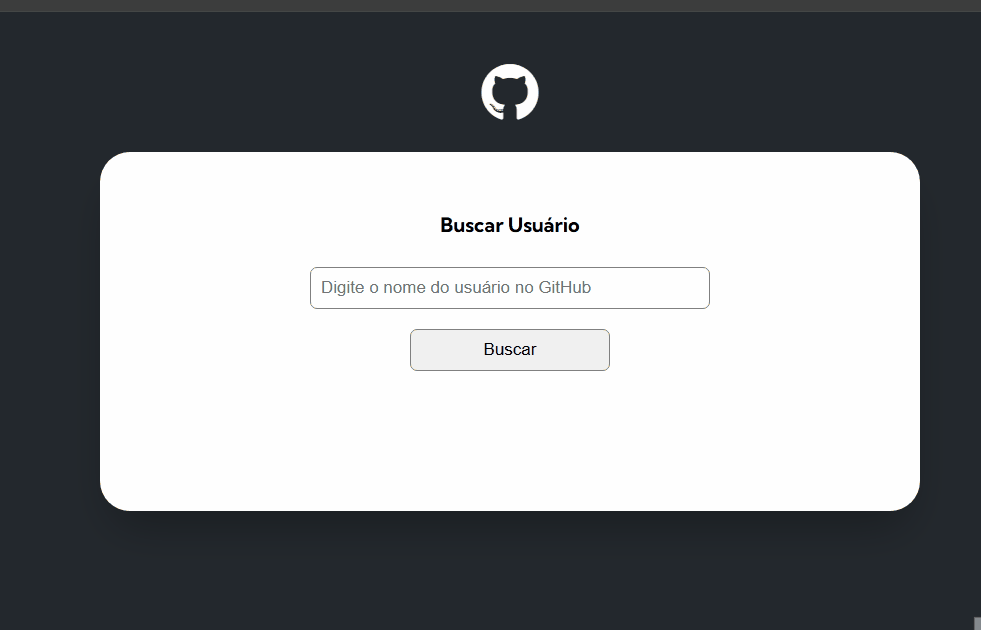

# Fetch da API do GitHub

Projeto do Curso DevQuest com intuito de criar uma página com busca de contas do GitHub, 10 de seus repositórios e 10 de seus eventos utilizando JavaScript

## Gifs

#### Versão desktop

### Link

- URL da solução: [Formulário com Validação](https://shyayhs.github.io/projeto-fetch-github/)

## Recursos utilizados

- Funcionalidades pelo Javascript
